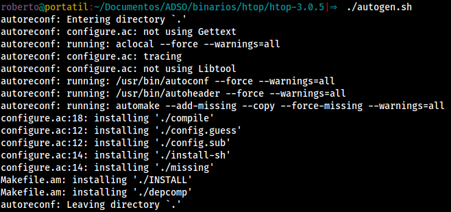
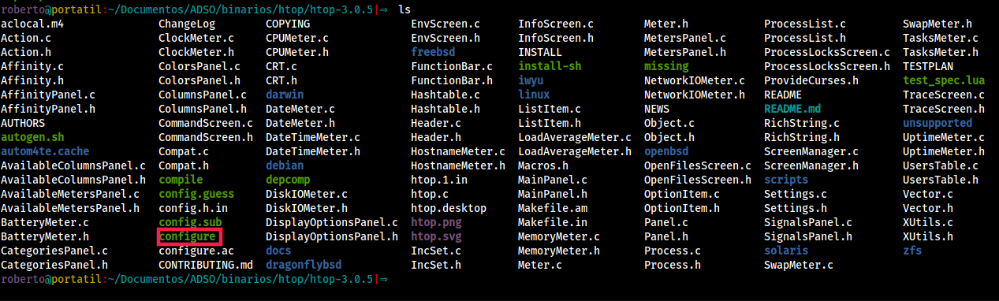
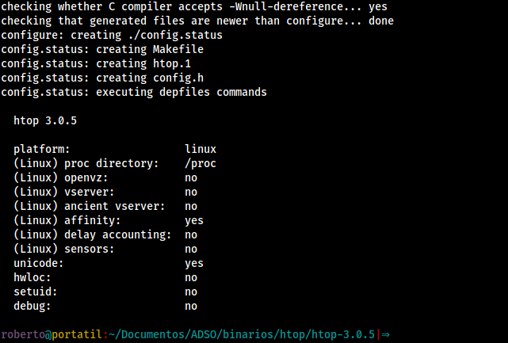
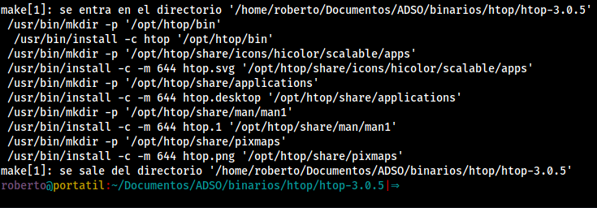
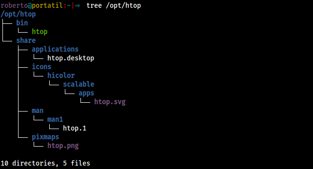
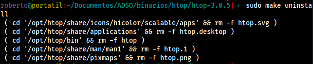
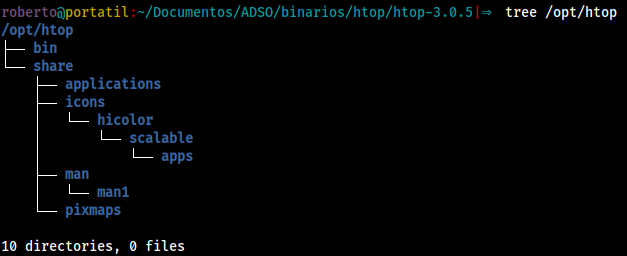


**Enunciado:** Elige el programa escrito en C que prefieras y comprueba en las fuentes que exista un fichero Makefile o Configure. Deberás compilar desde las fuentes.
Realiza los pasos necesarios para compilarlo e instálalo en tu equipo en un directorio que no interfiera con tu sistema de paquetes (/opt, /usr/local, etc.)
La corrección se hará en clase y deberás ser capaz de explicar qué son todos los ficheros que se hayan instalado y realizar una desinstalación limpia.


El programa elegido es `htop`, ya que está escrito en **C**. De momento no tiene ninguno de los ficheros requeridos, pero ejecutando el script `autogen.sh` se crea el fichero configure.
## Instalación
Para obtener las fuentes ejecutamos el siguiente comando:
```bash
$ apt source htop
```
### Configure
De momento el fichero no existe. Ejecutamos `autogen.sh`:
```bash
$ ./autogen.sh
```

Podemos comprobar que se ha generado el fichero **configure**:

Podemos ejecutar el fichero configure directamente. Sin embargo, de cara a una desinstalación más sencilla y a poder tener más localizados los ficheros instalados, vamos a cambiar la ruta que hay por defecto, al directorio `opt`. Se hace añadiendo la siguiente opción:
```bash
$ sudo mkdir /opt/htop
$ ./configure --prefix=/opt/htop/
```


En el caso de que se de algún error en la salida del comando, hay que instalar las **dependencias** indicadas, y repetir el paso anterior.


### Makefile
Para poder ejecutar `make` necesitamos el paquete `build-essential`, que contiene las utilidades esenciales para compilar un paquete en Debian.
```bash
$ sudo apt install build-essential
```
Para instalar el paquete ejecutamos:
```bash
$ sudo make install
```

El paquete ya está instalado. Podemos comprobar los ficheros creados en `/opt`:

Entre los ficheros que aparecen, los más importantes son el propio **binario** de htop, y el **manual**.
Para poder utilizar el comando la terminal tenemos que añadirlo al **PATH**. Para hacerlo, añadimos la siguiente línea al fichero `.bashrc`:
```bash
export PATH="/opt/htop/bin:$PATH"
```
## Desinstalación
Para desinstalar el paquete vamos a utilizar otra vez el comando make, esta vez con la opción `uninstall`:
```bash
$ sudo make uninstall
```

Tras eso, comprobamos si queda algo en la ubicación de la instalación:

la estructura de carpetas no se ha borrado, la borramos de manera manual.
Por último, hay que eliminar la línea de `.bashrc` que añade la ruta al `PATH`.