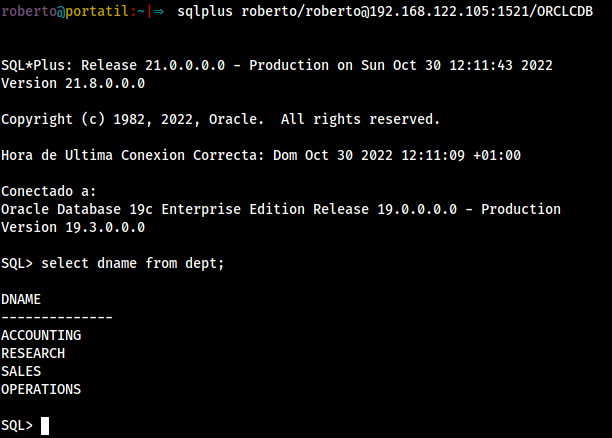
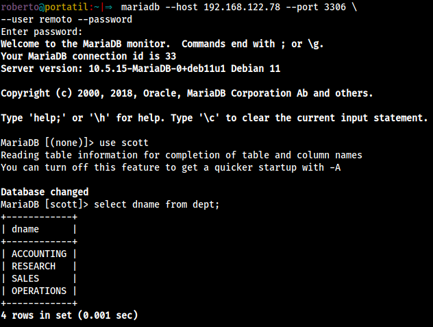
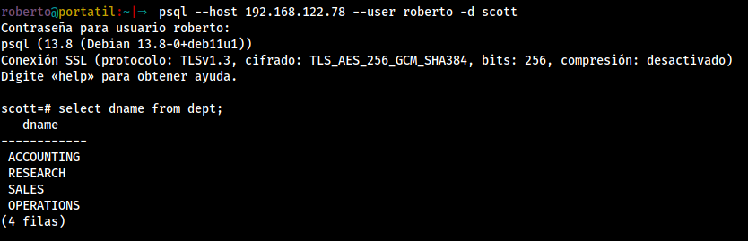

Vamos a realizar conexiones desde los clientes de BBDD a sus respectivos servidores.

## Oracle

En el lado del servidor, tiene que estar activo oracle (`startup`), también como se ha hecho en la instalación tiene que estar activado el listener

```bash
lsnrctl start
```

 y el firewall tiene que permitir el puerto `1521`

```bash
firewall-cmd --permanent --add-port=1521/tcp
firewall-cmd --reload
```

Para conectarnos de manera remota a oracle, tenemos que descargar en el lado del cliente **instantclient**, del siguiente [enlace](https://www.oracle.com/es/database/technologies/instant-client/linux-x86-64-downloads.html). En él hay varios enlaces de descarga. Los que nos interesan son:

* https://download.oracle.com/otn_software/linux/instantclient/218000/oracle-instantclient-basic-21.8.0.0.0-1.el8.x86_64.rpm
* https://download.oracle.com/otn_software/linux/instantclient/218000/oracle-instantclient-devel-21.8.0.0.0-1.el8.x86_64.rpm
* https://download.oracle.com/otn_software/linux/instantclient/218000/oracle-instantclient-sqlplus-21.8.0.0.0-1.el8.x86_64.rpm

En mi caso, el cliente es debian, así que tenemos que instalar los paquetes usando alien:

```bash
sudo alien -i --scripts oracle-instantclient-*
```

Una vez instalados, podemos acceder al servidor con `sqlplus`, donde la sintaxis es

```bash
sqlplus [USUARIO]/[CONTRASEÑA]@[IP:PUERTO]/[NOMBREBD]
```

```bash
sqlplus roberto/roberto@192.168.122.105:1521/ORCLCDB
```



En la captura se puede ver una consulta de prueba para comprobar que se ha accedido a la base de datos correctamente.

## MariaDB

Para conectarnos tenemos que instalar el paquete `mariadb-client`:

```bash
sudo apt install mariadb-client
```

Una vez instalado, ya podemos acceder al servidor. El comando tiene la siguiente sintaxis:

```bash
mariadb --host FULLY_QUALIFIED_DOMAIN_NAME --port TCP_PORT \
     --user DATABASE_USER --password \
     --ssl-verify-server-cert \
     --ssl-ca PATH_TO_PEM_FILE
```

Lo utilizamos con las opciones de nuestro servidor:

```bash
mariadb --host 192.168.122.78 --port 3306 \
--user remoto --password
```



## PostgreSQL

Para conectarnos tenemos que instalar el paquete `postgresql-client`

```bash
sudo apt install postgresql-client
```

Y nos conectamos al servidor usando el comando `psql`:

```bash
psql --host 192.168.122.78 --user roberto -d scott
```

