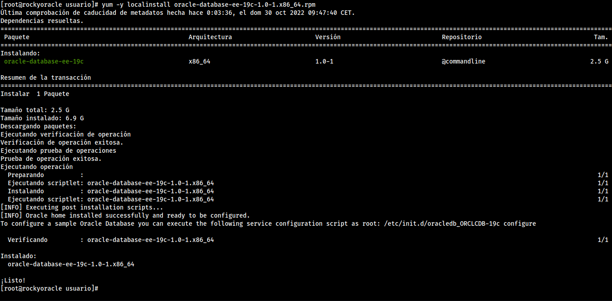

Se va a realizar la instalación de Oracle 19c en Rocky linux 8, debido a su mayor compatibilidad con el programa y menor número de fallos que con Debian 11.

## Pasos previos

Los siguientes pasos se deben ejecutar como usuario **root**.
Actualizamos el sistema:

```bash
dnf makecache
dnf update -y
```


Si al ejecutarlo se actualiza el **kernel**, deberíamos reiniciar la máquina.


como indica la [documentación](https://docs.oracle.com/en/database/oracle/oracle-database/19/ladbi/running-rpm-packages-to-install-oracle-database.html#GUID-BB7C11E3-D385-4A2F-9EAF-75F4F0AACF02), instalamos los requisitos previos. Sin embargo, al no estar en centos 7, tenemos que instalar manualmente unos paquetes

```bash
dnf install -y bc binutils compat-openssl10 elfutils-libelf glibc glibc-devel ksh libaio libXrender libX11 libXau libXi libXtst libgcc libnsl libstdc++ libxcb libibverbs make policycoreutils policycoreutils-python-utils smartmontools sysstat libnsl2 net-tools nfs-utils unzip
dnf install -y http://mirror.centos.org/centos/7/os/x86_64/Packages/compat-libcap1-1.10-7.el7.x86_64.rpm
dnf install -y http://mirror.centos.org/centos/7/os/x86_64/Packages/compat-libstdc++-33-3.2.3-72.el7.x86_64.rpm
```

Después descargamos los requisitos previos y los instalamos:

```bash
curl -o oracle-database-preinstall-19c-1.0-1.el7.x86_64.rpm https://yum.oracle.com/repo/OracleLinux/OL7/latest/x86_64/getPackage/oracle-database-preinstall-19c-1.0-1.el7.x86_64.rpm
yum -y localinstall oracle-database-preinstall-19c-1.0-1.el7.x86_64.rpm
```

Configuramos el firewall

```bash
firewall-cmd --permanent --add-port=1521/tcp
firewall-cmd --reload
```

configuramos el **target mode** de SELinux a permisivo:

```bash
sed -i 's/^SELINUX=.*/SELINUX=permissive/g' /etc/selinux/config
setenforce permissive
```

## Instalación

Ahora descargamos el paquete rpm de la [página oficial de oracle](https://www.oracle.com/es/database/technologies/oracle19c-linux-downloads.html):


```bash
yum -y localinstall oracle-database-ee-19c-1.0-1.x86_64.rpm 
```



Como nos indica al final de la instalación, creamos la base de datos de pruebas ejecutando el siguiente script:

```bash
/etc/init.d/oracledb_ORCLCDB-19c configure
```


Tras la ejecución, tenemos que iniciar sesión con el usuario **oracle** que se ha creado durante la misma, Y añadirle las siguientes variables al fichero `.bash_profile`


umask 022
export ORACLE_SID=ORCLCDB
export ORACLE_BASE=/opt/oracle/oradata
export ORACLE_HOME=/opt/oracle/product/19c/dbhome_1
export PATH=$PATH:$ORACLE_HOME/bin


Recargamos el fichero para que las variables tengan efecto:

```bash
source ~/.bash_profile
```

Tras este paso ya está instalado **oracle**, Ahora sigue crear la base de datos. Primero activamos el listener:

```bash
lsnrctl start
```

Para facilitar la utilización de `sqlplus` vamos a instalar el paquete `rlwrap`, que permite que utilicemos el cursor, tanto para desplazarnos por las líneas como para rescatar comandos.

```bash
dnf install epel-release
dnf install rlwrap -y
```

ahora creamos el siguiente alias en `~/.bashrc`:

```bash
alias sqlplus='rlwrap sqlplus'
```

## Configuración

Primero nos conectamos a la base de datos como **sysdba**:

```bash
sqlplus / as sysdba
```

y podemos comprobar la versión de oracle con la siguiente consulta:

```sql
SELECT instance_name, host_name, version, startup_time FROM v$instance;
```


### Creación de usuario con privilegios

Vamos a crear un usuario para poder acceder a la base de datos sin utilizar el **sysdba**, con los siguientes comandos. Antes de crear el usuario, tenemos  que activar `_ORACLE_SCRIPT` para que se puedan ejecutar sin errores los siguientes comandos:

```sql
alter session set "_ORACLE_SCRIPT"=true;
CREATE USER roberto IDENTIFIED BY roberto;
GRANT ALL PRIVILEGES TO roberto;
```

Una vez creado el usuario podemos conectarnos con él utilizando el siguiente comando:

```bash
sqlplus roberto/roberto
```

## Creación de tablas

Vamos a introducir a modo de prueba, el esquema **scott**:

```sql
CREATE TABLE DEPT
(
 DEPTNO NUMBER(2),
 DNAME VARCHAR2(14),
 LOC VARCHAR2(13),
 CONSTRAINT PK_DEPT PRIMARY KEY (DEPTNO)
);
CREATE TABLE EMP
(
 EMPNO NUMBER(4),
 ENAME VARCHAR2(10),
 JOB VARCHAR2(9),
 MGR NUMBER(4),
 HIREDATE DATE,
 SAL NUMBER(7, 2),
 COMM NUMBER(7, 2),
 DEPTNO NUMBER(2),
 CONSTRAINT FK_DEPTNO FOREIGN KEY (DEPTNO) REFERENCES DEPT (DEPTNO),
 CONSTRAINT PK_EMP PRIMARY KEY (EMPNO)
);
INSERT INTO DEPT VALUES (10, 'ACCOUNTING', 'NEW YORK');
INSERT INTO DEPT VALUES (20, 'RESEARCH', 'DALLAS');
INSERT INTO DEPT VALUES (30, 'SALES', 'CHICAGO');
INSERT INTO DEPT VALUES (40, 'OPERATIONS', 'BOSTON');
INSERT INTO EMP VALUES(7369, 'SMITH', 'CLERK', 7902,TO_DATE('17-DIC-1980', 'DD-MON-YYYY'), 800, NULL, 20);
INSERT INTO EMP VALUES(7499, 'ALLEN', 'SALESMAN', 7698,TO_DATE('20-FEB-1981', 'DD-MON-YYYY'), 1600, 300, 30);
INSERT INTO EMP VALUES(7521, 'WARD', 'SALESMAN', 7698,TO_DATE('22-FEB-1981', 'DD-MON-YYYY'), 1250, 500, 30);
INSERT INTO EMP VALUES(7566, 'JONES', 'MANAGER', 7839,TO_DATE('2-ABR-1981', 'DD-MON-YYYY'), 2975, NULL, 20);
INSERT INTO EMP VALUES(7654, 'MARTIN', 'SALESMAN', 7698,TO_DATE('28-SEP-1981', 'DD-MON-YYYY'), 1250, 1400, 30);
INSERT INTO EMP VALUES(7698, 'BLAKE', 'MANAGER', 7839,TO_DATE('1-MAY-1981', 'DD-MON-YYYY'), 2850, NULL, 30);
INSERT INTO EMP VALUES(7782, 'CLARK', 'MANAGER', 7839,TO_DATE('9-JUN-1981', 'DD-MON-YYYY'), 2450, NULL, 10);
INSERT INTO EMP VALUES(7788, 'SCOTT', 'ANALYST', 7566,TO_DATE('09-DIC-1982', 'DD-MON-YYYY'), 3000, NULL, 20);
INSERT INTO EMP VALUES(7839, 'KING', 'PRESIDENT', NULL,TO_DATE('17-NOV-1981', 'DD-MON-YYYY'), 5000, NULL, 10);
INSERT INTO EMP VALUES(7844, 'TURNER', 'SALESMAN', 7698,TO_DATE('8-SEP-1981', 'DD-MON-YYYY'), 1500, 0, 30);
INSERT INTO EMP VALUES(7876, 'ADAMS', 'CLERK', 7788,TO_DATE('12-ENE-1983', 'DD-MON-YYYY'), 1100, NULL, 20);
INSERT INTO EMP VALUES(7900, 'JAMES', 'CLERK', 7698,TO_DATE('3-DIC-1981', 'DD-MON-YYYY'), 950, NULL, 30);
INSERT INTO EMP VALUES(7902, 'FORD', 'ANALYST', 7566,TO_DATE('3-DIC-1981', 'DD-MON-YYYY'), 3000, NULL, 20);
INSERT INTO EMP VALUES(7934, 'MILLER', 'CLERK', 7782,TO_DATE('23-ENE-1982', 'DD-MON-YYYY'), 1300, NULL, 10);

COMMIT;
```

Las tablas se crean sin errores y se introducen los valores. Podemos realizar una consulta sencilla:

```sql
SELECT ename
FROM emp
WHERE deptno = (SELECT deptno
                FROM dept
                WHERE dname = 'SALES');
```

