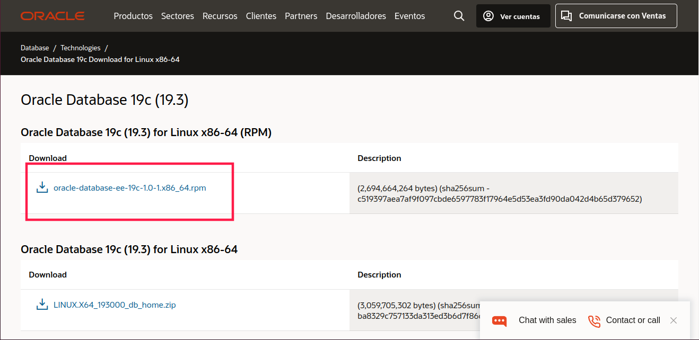
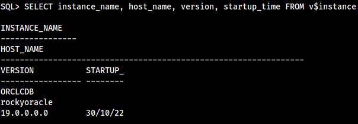

Se va a realizar la instalación de Oracle 21c en Rocky linux 8, debido a su mayor compatibilidad con el programa y menor número de fallos que con Debian 11.

## Pasos previos

Los siguientes pasos se deben ejecutar como usuario **root**.
Actualizamos el sistema:

```bash
dnf makecache
dnf update -y
```


Si al ejecutarlo se actualiza el **kernel**, deberíamos reiniciar la máquina.


instalamos los prerrequisistos:

```bash
dnf install -y bc binutils compat-openssl10 elfutils-libelf glibc glibc-devel ksh libaio libXrender libX11 libXau libXi libXtst libgcc libnsl libstdc++ libxcb libibverbs make policycoreutils policycoreutils-python-utils smartmontools sysstat libnsl2 net-tools nfs-utils unzip
```

creamos grupos y usuarios:

```bash
groupadd -g 1501 oinstall
groupadd -g 1502 dba
groupadd -g 1503 oper
groupadd -g 1504 backupdba
groupadd -g 1505 dgdba
groupadd -g 1506 kmdba
groupadd -g 1507 racdba
useradd -u 1501 -g oinstall -G dba,oper,backupdba,dgdba,kmdba,racdba oracle
echo "oracle" | passwd oracle --stdin
```

Ahora tenemos que crear dos ficheros de configuración:

1. creamos el fichero `/etc/security/limits.d/30-oracle.conf`, con el siguiente contenido:


oracle   soft   nofile   1024
oracle   hard   nofile   65536
oracle   soft   nproc    16384
oracle   hard   nproc    16384
oracle   soft   stack    10240
oracle   hard   stack    32768
oracle   hard   memlock  134217728
oracle   soft   memlock  134217728
oracle   soft   data     unlimited
oracle   hard   data     unlimited


2. creamos el fichero `/etc/sysctl.d/98-oracle.conf`, con el siguiente contenido


fs.file-max = 6815744
kernel.sem = 250 32000 100 128
kernel.shmmni = 4096
kernel.shmall = 1073741824
kernel.shmmax = 4398046511104
kernel.panic_on_oops = 1
net.core.rmem_default = 262144
net.core.rmem_max = 4194304
net.core.wmem_default = 262144
net.core.wmem_max = 1048576
net.ipv4.conf.all.rp_filter = 2
net.ipv4.conf.default.rp_filter = 2
fs.aio-max-nr = 1048576
net.ipv4.ip_local_port_range = 9000 65500


Recargamos los parámetros del kernel con **sysctl**:

```bash
sysctl -p
```

configuramos el **target mode** de SELinux a permisivo:

```bash
sed -i 's/^SELINUX=.*/SELINUX=permissive/g' /etc/selinux/config
setenforce permissive
```

Configuramos el firewall

```bash
firewall-cmd --permanent --add-port=1521/tcp
firewall-cmd --reload
```

Creamos los directorios necesarios:

```bash
mkdir -p /u01/app/oracle/product/21.3.0/dbhome_1
mkdir -p /u02/oradata
chown -R oracle:oinstall /u01 /u02
chmod -R 775 /u01 /u02
```

Configuramos el entorno del usuario: Entramos como el usuario **oracle**

```bash
su oracle
```

Y añadimos al fichero `~/.bashrc` la configuración para tener las variables de entorno:


# Oracle Settings
export TMP=/tmp
export TMPDIR=$TMP

export ORACLE_HOSTNAME=oracle-02.centlinux.com
export ORACLE_UNQNAME=cdb1
export ORACLE_BASE=/u01/app/oracle
export ORACLE_HOME=$ORACLE_BASE/product/21.3.0/dbhome_1
export ORA_INVENTORY=/u01/app/oraInventory
export ORACLE_SID=cdb1
export PDB_NAME=pdb1
export DATA_DIR=/u02/oradata

export PATH=$ORACLE_HOME/bin:$PATH

export LD_LIBRARY_PATH=$ORACLE_HOME/lib:/lib:/usr/lib
export CLASSPATH=$ORACLE_HOME/jlib:$ORACLE_HOME/rdbms/jlib


Podemos recargar la configuración con el siguiente comando:

```bash
source ~/.bashrc
```

## Instalación

Ahora tenemos que descargar oracle. Para descargarlo tenemos que ir a la [página de descargas de oracle](https://www.oracle.com/database/technologies/oracle-database-software-downloads.html) y buscamos en el apartado de Oracle 21c, el zip de Linux:


Una vez descargado, descomprimimos el fichero en el directorio que establecimos previamente como  `$ORACLE_HOME`:

```bash
unzip LINUX.X64_213000_db_home.zip -d $ORACLE_HOME
```

Ahora nos desplazamos al directorio y ejecutamos el script de instalación:


cd $ORACLE_HOME
./runInstaller -ignorePrereq -waitforcompletion -silent \
oracle.install.option=INSTALL_DB_SWONLY \
ORACLE_HOSTNAME=${ORACLE_HOSTNAME} \
UNIX_GROUP_NAME=oinstall \
INVENTORY_LOCATION=${ORA_INVENTORY} \
ORACLE_HOME=${ORACLE_HOME} \
ORACLE_BASE=${ORACLE_BASE} \
oracle.install.db.InstallEdition=EE \
oracle.install.db.OSDBA_GROUP=dba \
oracle.install.db.OSBACKUPDBA_GROUP=backupdba \
oracle.install.db.OSDGDBA_GROUP=dgdba \
oracle.install.db.OSKMDBA_GROUP=kmdba \
oracle.install.db.OSRACDBA_GROUP=racdba \
SECURITY_UPDATES_VIA_MYORACLESUPPORT=false \
DECLINE_SECURITY_UPDATES=true



Ahora ejecutamos como **root** los scripts de post-instalación:

```bash
/u01/app/oraInventory/orainstRoot.sh
/u01/app/oracle/product/21.3.0/dbhome_1/root.sh
```

Tras este paso ya está instalado **oracle**, Ahora sigue crear la base de datos. Primero activamos el listener:

```bash
lsnrctl start
```

Y creamos la base de datos con el comando `dbca` con los siguientes parámetros:

```bash
dbca -silent -createDatabase \
-templateName General_Purpose.dbc \
-gdbname ${ORACLE_SID} \
-sid ${ORACLE_SID} \
-responseFile NO_VALUE \
-characterSet AL32UTF8 \
-sysPassword contra \
-systemPassword contra \
-createAsContainerDatabase true \
-numberOfPDBs 1 \
-pdbName ${PDB_NAME} \
-pdbAdminPassword contra \
-databaseType MULTIPURPOSE \
-automaticMemoryManagement false \
-totalMemory 800 \
-storageType FS \
-datafileDestination "${DATA_DIR}" \
-redoLogFileSize 50 \
-emConfiguration NONE \
-ignorePreReqs
```



Las alertas que aparecen se deben a la poca seguridad de la contraseña que he elegido (en este caso **contra**, no tienen nada que ver con problemas durante la instalación


Para facilitar la utilización de `sqlplus` vamos a instalar el paquete `rlwrap`, que permite que utilicemos el cursor, tanto para desplazarnos por las líneas como para rescatar comandos.

```bash
dnf install epel-release
dnf install rlwrap -y
```

ahora creamos el siguiente alias en `~/.bashrc`:
```bash
alias sqlplus='rlwrap sqlplus'
```

## Configuración

Primero nos conectamos a la base de datos como **sysdba**:

```bash
sqlplus / as sysdba
```



Podemos comprobar la versión de oracle que tenemos instalada. Una vez dentro, activamos el modo **Oracle Managed File** para que oarcle no sea capaz de modificar archivos del sistema anfitrión:

```sql
ALTER SYSTEM SET DB_CREATE_FILE_DEST='/u02/oradata' SCOPE=BOTH;
```

Activamos el **autostart**:

```sql
ALTER PLUGGABLE DATABASE PDB1 SAVE STATE;
```

### Creación de usuario con privilegios

Vamos a crear un usuario para poder acceder a la base de datos sin utilizar el **sysdba**, con los siguientes comandos. Antes de crear el usuario, tenemos  que activar `_ORACLE_SCRIPT` para que se puedan ejecutar sin errores los siguientes comandos:

```sql
alter session set "_ORACLE_SCRIPT"=true;
CREATE USER roberto IDENTIFIED BY roberto;
GRANT ALL PRIVILEGES TO roberto;
```

Una vez creado el usuario podemos conectarnos con él utilizando el siguiente comando:

```bash
sqlplus roberto/roberto
```

## Creación de tablas

Vamos a introducir a modo de prueba, el esquema **scott**:

```sql
CREATE TABLE DEPT
(
 DEPTNO NUMBER(2),
 DNAME VARCHAR2(14),
 LOC VARCHAR2(13),
 CONSTRAINT PK_DEPT PRIMARY KEY (DEPTNO)
);
CREATE TABLE EMP
(
 EMPNO NUMBER(4),
 ENAME VARCHAR2(10),
 JOB VARCHAR2(9),
 MGR NUMBER(4),
 HIREDATE DATE,
 SAL NUMBER(7, 2),
 COMM NUMBER(7, 2),
 DEPTNO NUMBER(2),
 CONSTRAINT FK_DEPTNO FOREIGN KEY (DEPTNO) REFERENCES DEPT (DEPTNO),
 CONSTRAINT PK_EMP PRIMARY KEY (EMPNO)
);
INSERT INTO DEPT VALUES (10, 'ACCOUNTING', 'NEW YORK');
INSERT INTO DEPT VALUES (20, 'RESEARCH', 'DALLAS');
INSERT INTO DEPT VALUES (30, 'SALES', 'CHICAGO');
INSERT INTO DEPT VALUES (40, 'OPERATIONS', 'BOSTON');
INSERT INTO EMP VALUES(7369, 'SMITH', 'CLERK', 7902,TO_DATE('17-DIC-1980', 'DD-MON-YYYY'), 800, NULL, 20);
INSERT INTO EMP VALUES(7499, 'ALLEN', 'SALESMAN', 7698,TO_DATE('20-FEB-1981', 'DD-MON-YYYY'), 1600, 300, 30);
INSERT INTO EMP VALUES(7521, 'WARD', 'SALESMAN', 7698,TO_DATE('22-FEB-1981', 'DD-MON-YYYY'), 1250, 500, 30);
INSERT INTO EMP VALUES(7566, 'JONES', 'MANAGER', 7839,TO_DATE('2-ABR-1981', 'DD-MON-YYYY'), 2975, NULL, 20);
INSERT INTO EMP VALUES(7654, 'MARTIN', 'SALESMAN', 7698,TO_DATE('28-SEP-1981', 'DD-MON-YYYY'), 1250, 1400, 30);
INSERT INTO EMP VALUES(7698, 'BLAKE', 'MANAGER', 7839,TO_DATE('1-MAY-1981', 'DD-MON-YYYY'), 2850, NULL, 30);
INSERT INTO EMP VALUES(7782, 'CLARK', 'MANAGER', 7839,TO_DATE('9-JUN-1981', 'DD-MON-YYYY'), 2450, NULL, 10);
INSERT INTO EMP VALUES(7788, 'SCOTT', 'ANALYST', 7566,TO_DATE('09-DIC-1982', 'DD-MON-YYYY'), 3000, NULL, 20);
INSERT INTO EMP VALUES(7839, 'KING', 'PRESIDENT', NULL,TO_DATE('17-NOV-1981', 'DD-MON-YYYY'), 5000, NULL, 10);
INSERT INTO EMP VALUES(7844, 'TURNER', 'SALESMAN', 7698,TO_DATE('8-SEP-1981', 'DD-MON-YYYY'), 1500, 0, 30);
INSERT INTO EMP VALUES(7876, 'ADAMS', 'CLERK', 7788,TO_DATE('12-ENE-1983', 'DD-MON-YYYY'), 1100, NULL, 20);
INSERT INTO EMP VALUES(7900, 'JAMES', 'CLERK', 7698,TO_DATE('3-DIC-1981', 'DD-MON-YYYY'), 950, NULL, 30);
INSERT INTO EMP VALUES(7902, 'FORD', 'ANALYST', 7566,TO_DATE('3-DIC-1981', 'DD-MON-YYYY'), 3000, NULL, 20);
INSERT INTO EMP VALUES(7934, 'MILLER', 'CLERK', 7782,TO_DATE('23-ENE-1982', 'DD-MON-YYYY'), 1300, NULL, 10);

COMMIT;
```

Las tablas se crean sin errores y se introducen los valores. Podemos realizar una consulta sencilla:

```sql
SELECT ename
FROM emp
WHERE deptno = (SELECT deptno
                FROM dept
                WHERE dname = 'SALES');
```

