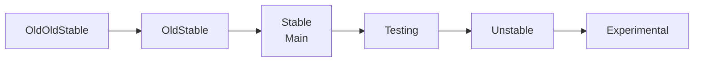
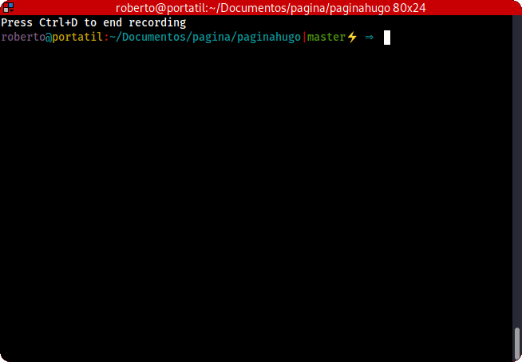


graph LR;
A[OldOldStable]-->B[OldStable];
B-->C[Stable<br>Main]
C-->D[Testing]
D-->E[Unstable]
E-->F[Experimental]


/etc/apt/preferences

## COMANDOS USADOS:

```bash
apt policy mdadm
sudo apt-listbugs -s all list mdadm
sudo apt install --simulate mdadm
dpkg --print-architecture
dpkg --print-foreign-architectures
sudo dpkg --add-architecture arm64

# primero simulamos la instalación
sudo apt install --simulate mdadm/bullseye-backports
# luego instalamos
sudo apt install -t bullseye-backports mdadm
sudo apt install mdadm/bullseye-backports
# o modificando el fichero de preferencia

# para borrarlo
sudo apt remove mdadm
sudo apt purge mdadm

sudo apt install mdadm=4.21~bpo11+1 --install-recommends # para instalar las recomendaciones

sudo apt policy beep
sudo apt install beep:i386

sudo apt-rdepends mdadm

# paquete necesario
apt policy signing-party
apt install signing-party

apt-rdepends -d mdadm >> graficomdadm.dot
springgraph < graficomdadm.dot > graficomdadm.png   

```

Configuración del fichero debconf:
```bash
sudo dpkg-reconfigure debconf
sudo dpkg-reconfigure mdadm
sudo dpkg-reconfigure keyboard-configuration --frontend dialog --priority critical
# con el siguiente comando vemos las opciones configuradas con debconf
sudo debconf-show mdadm
# para saber si un paquete utiliza debconf vemos la dependencia inversa
apt show keyboard-configuration 
```

las arquitecturas están en la página de debian
/etc/apt/preferences
getselections
dpkg --info mdadm
apt clean



## KERNEL

```bash
sudo apt-source install linuxsource=5.19.11-1 

sudo apt install --simulate build-essential flex bison openssl libssl-deb dkms libncurses-dev ncurses-dev qtbase5-deb libelf-dev
```
