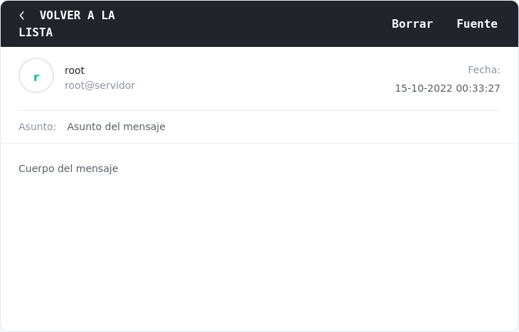

En esta entrada vamos a configurar un servidor de correos postfix para poder monitorizar las alertas que da snort de manera remota. Para ello vamos a utilizar el servidor por medio del comando swatch, que se encargará de comprobar el log de snort.

## Postfix
### Instalación
Antes de iniciar la instalación tenemos que comprobar el nombre de nuestra máquina, con el comando
```bash
$ hostname
```
Para instalar postfix previamente tenemos que instalar mailutils:
```bash
$ sudo apt update
$ sudo apt install mailutils
$ sudo apt install postfix
```
Tras la instalación de postfix, Se inciará un setup. En él seleccionamos **Internet site**, la opción por defecto. En el siguiente paso, si no está ya, introducimos el nombre de la máquina que consultamos antes. 

### Configuración

Una vez instalado, tenemos que editar varias líneas en el fichero de configuración: `/etc/postfix/main.cf`; tenemos que cambiar las siguientes líneas:
```bash
inet_interfaces = loopback-only
mydestination = $myhostname, localhost.$your_domain, $your_domain
```
Tras eso reiniciamos el servicio 
```bash
$ sudo systemctl restart postfix
```

Con la configuración actual, no podemos enviar correos a una dirección de correo habitual (gmail, hotmail..) ya que nuestro servidor postfix no tiene **autentificación SASL** ni **encriptación SLS**, por lo que los proveedores de correo lo rechazan automáticamente.


Para comprobar que funciona podemos enviar un correo de prueba. Para el ejemplo, vamos a enviarlo a un correo temporal como [este](https://temp-mail.org/es/), ya que no realiza las mismas comprobaciones que gmail.

Enviamos el correo con el siguiente comando:
```bash
$ echo "Cuerpo del mensaje" | mail -s "Asunto del mensaje" correoelectronico
```


Para más información:
[instalación postfix](https://netcorecloud.com/tutorials/install-postfix-as-send-only-smtp-server/),
[SASL y SLS](https://souptonuts.sourceforge.net/postfix_tutorial.html)
